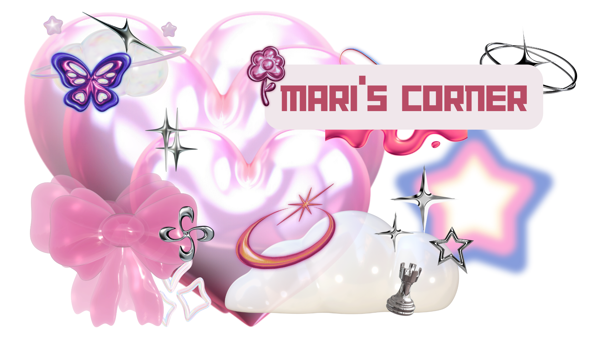

  

<h1 align="center"> Hi there!  I'm Mari🩷
</h1>

<h3 align="center"> <i>Bachelor of Science in Computer Science Undergraduate </i>
  
</h3>

I am an enthusiastic third-year student at the <b> University of the Philippines - Manila </b>, currently pursuing a degree in <i> BS Computer Science </i>💻 specializing in Health Informatics 🩺 🏥 I am passionate about <i>front-end development</i>🖌️🌹, while also interested in other fields such as <i> Database System Management</i> 🗒️ and <i> Cybersecurity</i> :lock: 

Want to <b>collaborate?</b> I'd be happy to! You can reach me through the following links below 🌻

 

 
 

 
   <i> "Medicine, Law, Business, Engineering  
  -- these are noble pursuits and are necessary to sustain life.  
  But poetry, beauty, romance, love, this is what we stay alive for.  "
  - N.H Kleinbaum, Dead Poets Society </i> 

 

<!---
mrdimaculangan/mrdimaculangan is a ✨ special ✨ repository because its `README.md` (this file) appears on your GitHub profile.
You can click the Preview link to take a look at your changes.
--->
